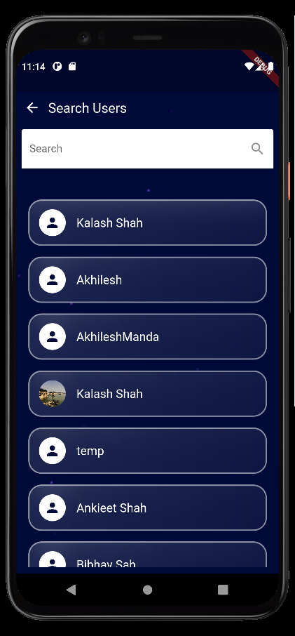

# Programmer Profile Frontend

An application to help coders keep track of their coding activity and growth across multiple platforms! Currently the app supports github, leetcode and codeforces profile.

## Features

- Email Authentication with verify OTP
- Profile Page - **GitHub authentication and Codeforces, Leetcode username settings, update profile picture**
- Home Screen - User description (can be edited in markdown), Custom HeatMap (heatmap activity shows acitivity on all platforms), Graphical Analysis of all platforms
- Events and Contest Screen - Shows all upcoming events and contests in a beautiful custom scrollable UI
- Search Users - Find and follow your friends and get inspired to code!

## Technical Features

- Feature based MVC architecture
- GraphQL APIs Integration
- State Management - provider
- Lottie Animations

## Screenshots
<table>
  <tr>
     <td>Dashboard Heatmap</td>
     <td>Leetcode Analysis</td>
     <td>Codeforces Analysis</td>
     <td>GitHub Analysis</td>
     <td>Notification Screen</td>
     <td>Profile Screen</td>
     <td>Contest and Events Screen</td>
     <td>Search Users Screen</td>
     <td>New Users Screen</td>
  </tr>
  <tr>
    <td></td>
    <td></td>
    <td></td>
    <td></td>
    <td></td>
    <td></td>
    <td></td>
    <td></td>
    <td></td>
  </tr>
 </table>
